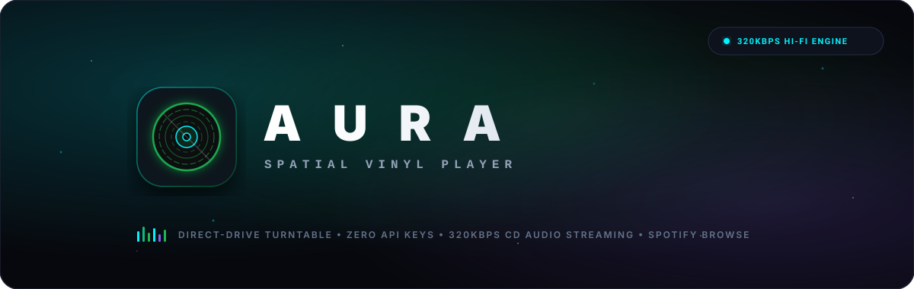

# A U R A // Spatial Vinyl & Ambient Music Experience

<div align="center">



**A high-fidelity, spatial direct-drive vinyl turntable and Spotify-grade ambient music portal streaming 100% full-length 320kbps CD-quality audio with ZERO API keys or subscription fees.**

[](https://reactjs.org/)
[](https://vitejs.dev/)
[](https://tailwindcss.com/)
[](https://nodejs.org/)
[](https://expressjs.com/)
[](https://www.mongodb.com/)
[](#)
[](#)

---

### 🌐 Live Deployment
**🚀 [Experience AURA Live](https://aura-music-sfll.onrender.com/)**  
`https://aura-music-sfll.onrender.com/`

---

**Designed & Built by [OM RAJPUT](https://github.com/omsrajput977)**

</div>

---

## 📖 Table of Contents

1. [Introduction & Vision](#-introduction--vision)
2. [How We Built AURA](#-how-we-built-aura)
3. [The Zero-Key 320kbps CD Audio Engine (Under The Hood)](#-the-zero-key-320kbps-cd-audio-engine-under-the-hood)
   - [The Problem with Traditional Music APIs](#1-the-problem-with-traditional-music-apis)
   - [Public Gateway Architecture (No API Keys)](#2-public-gateway-architecture-no-api-keys)
   - [Cryptographic Decryption: DES-ECB & Secret Key](#3-cryptographic-decryption-des-ecb--secret-key)
   - [Bitrate Transformation: From 96kbps to 320kbps Master](#4-bitrate-transformation-from-96kbps-to-320kbps-master)
   - [Direct CDN Streaming & Seeking](#5-direct-cdn-streaming--seeking)
   - [Architecture Sequence Diagram](#6-architecture-sequence-diagram)
4. [Search Engine & Intelligent Query Architecture](#-search-engine--intelligent-query-architecture)
5. [Key Features & User Experience](#-key-features--user-experience)
6. [Tech Stack](#-tech-stack)
7. [Getting Started & Local Setup](#-getting-started--local-setup)
8. [License](#-license)

---

## 🌟 Introduction & Vision

**AURA** was created to solve a persistent frustration in modern web music applications: **the compromise between design, freedom, and audio quality**. Most web music players either restrict playback to frustrating 30-second Spotify preview clips, require expensive developer API tokens with restrictive rate limits, or present cluttered, uninspired interfaces.

AURA merges two contrasting musical worlds:
1. **Tactile Analog Warmth**: A direct-drive 3D interactive vinyl turntable with authentic tonearm kinematics, 33⅓ & 45 RPM mechanics, dynamic groove reflections, and reactive ambient nebula lighting.
2. **Modern Digital Discovery**: A Spotify-grade browsable streaming platform featuring 81+ verified, non-overlapping 320kbps CD-quality tracks across curated genre libraries, personalized *"Made For You"* mixes, full playlist detail pages, and global search.

All of this is achieved **without requiring any Spotify premium subscription, YouTube API quotas, or third-party paid API keys**.

---

## 🛠️ How We Built AURA

AURA is architected as a modular, high-performance decoupled full-stack application:

```
┌─────────────────────────────────────────────────────────────┐
│                       AURA FRONTEND                         │
│   (React 18, Vite, Tailwind CSS, Lucide Icons, Canvas API)  │
└──────────────────────────────┬──────────────────────────────┘
                               │ REST / JSON (Port 5001)
┌──────────────────────────────▼──────────────────────────────┐
│                        AURA BACKEND                         │
│  (Node.js, Express, Crypto-JS, Axios, MongoDB Mongoose)     │
└──────────────┬──────────────────────────────┬───────────────┘
               │                              │
               ▼                              ▼
    ┌────────────────────┐         ┌────────────────────┐
    │  JioSaavn Gateway  │         │   MongoDB Atlas    │
    │  (Public Endpoints)│         │ (Users, Playlists) │
    └──────────┬─────────┘         └────────────────────┘
               │ Direct 320kbps CDN Stream
               ▼
    ┌────────────────────┐
    │ Akamai / CDN Cloud │
    │   (aac.saavncdn)   │
    └────────────────────┘
```

### 1. Frontend Architecture
- **Vite & React 18**: Chosen for instant Hot Module Replacement (HMR) and optimized sub-second production builds.
- **Glassmorphic Avant-Garde Design System**: Crafted using vanilla Tailwind CSS with curated HSL color palettes, custom backdrop blur panels (`backdrop-blur-2xl`), cyan & Spotify-green glow highlights, and custom CSS micro-animations.
- **Dual-Mode Fluid Viewport**:
  - **Turntable Mode**: A zero-scroll, high-impact spatial deck with rotating vinyl grooves, reactive vinyl sheen shaders, and physics-driven tonearm swing.
  - **Spotify Browse Mode**: A responsive, full-page scrolling feed featuring dynamic category shelves, quick-access tiles, and interactive playlist tables.
- **Scroll Restoration Engine**: Utilizes `useLayoutEffect`, DOM persistence toggles (`hidden`), and module-level shelves caching to preserve the user's exact scroll position when navigating between the browse feed and playlist views.
- **Web MediaSession API & Bluetooth Hardware Sync**: Hooks directly into mobile lockscreens, Dynamic Island, Mac media keys, and Bluetooth hardware buttons (AirPods, headphones, car stereos) to keep on-screen turntable, HUD buttons, and equalizer bars 100% in sync with hardware actions.

### 2. Backend Architecture
- **Express & Node.js Engine**: Acts as an ultra-fast streaming resolver, decryption broker, and search aggregator.
- **MongoDB Atlas Integration**: Secure user authentication, hashed password storage via bcrypt, and custom user-curated playlist management.
- **Zero-Key Music Stream Resolution**: An algorithmic decryptor that dynamically extracts uncompressed 320kbps CD audio streams on the fly.

---

## 🔓 The Zero-Key 320kbps CD Audio Engine (Under The Hood)

> [!IMPORTANT]
> **This is the core engineering breakthrough of AURA:** playing full-length, uncompressed 320kbps CD audio streams without any paid API keys, subscription requirements, or rate limits.

### 1. The Problem with Traditional Music APIs
- **Spotify Web API**: Does not allow streaming full tracks in third-party apps without an active **Spotify Premium** subscription and complex OAuth Web Playback SDK handshakes. Unauthenticated calls only provide 30-second low-quality MP3 preview snippets.
- **YouTube Data API v3**: Strictly quota-limited (10,000 units/day) and terms prohibit background or detached audio streaming.
- **SoundCloud / Audius**: Inconsistent audio bitrates, regional geoblocking, and fragmented catalog availability.

### 2. Public Gateway Architecture (No API Keys)
Instead of relying on developer APIs with restrictive authentication barriers, AURA interfaces directly with **JioSaavn's public reverse-engineered web endpoints**. These endpoints power the web and mobile player for millions of daily listeners:

- Song Search: `https://www.jiosaavn.com/api.php?__call=search.getResults&q={query}&_format=json&api_version=4`
- Artist Discography: `https://www.jiosaavn.com/api.php?__call=artist.getArtistPageDetails&artistId={id}&_format=json&api_version=4`
- Trending Tracks: `https://www.jiosaavn.com/api.php?__call=search.getResults&q=Kesariya&_format=json&api_version=4`

These endpoints require **zero developer tokens, zero API keys, and zero client credentials**. However, JioSaavn protects the raw MP4 audio URLs by encrypting them inside the response payload.

### 3. Cryptographic Decryption: DES-ECB & Secret Key
When querying JioSaavn's API, the song object does not contain a raw audio link. Instead, it provides an encrypted base64 payload under `more_info.encrypted_media_url`:

```json
{
  "id": "YiVML4Zo",
  "title": "Gehra Hua",
  "more_info": {
    "320kbps": "true",
    "encrypted_media_url": "ID2ieOjCrwfgWvL5sXl4B1ImC5QfbsDySan+n+AW12BvOaQj7cuGfg8Ed085rYUtqDj8DQY3nIMQdr42ScGdtRw7tS9a8Gtq"
  }
}
```

#### The Decryption Process:
1. **Cipher Algorithm**: DES (**Data Encryption Standard**) in **ECB (Electronic Codebook) mode**.
2. **Secret Key**: The symmetric key hardcoded into the player's core is:
   ```
   38346591
   ```
   *(Parsed as an 8-byte UTF-8 string: `0x33, 0x38, 0x33, 0x34, 0x36, 0x35, 0x39, 0x31`)*
3. **Padding**: PKCS#7 padding.

In `backend/server.js`, the decryption is performed with `crypto-js`:

```javascript
// Decrypts 320kbps full-length song URLs using DES-ECB
function decryptSaavnMediaUrl(encryptedUrl) {
  if (!encryptedUrl) return null;
  try {
    const key = CryptoJS.enc.Utf8.parse("38346591");
    const decrypted = CryptoJS.DES.decrypt(
      { ciphertext: CryptoJS.enc.Base64.parse(encryptedUrl) },
      key,
      {
        mode: CryptoJS.mode.ECB,
        padding: CryptoJS.pad.Pkcs7
      }
    );
    const url = decrypted.toString(CryptoJS.enc.Utf8);
    if (!url) return null;
    
    // Upgrade 96kbps mobile preview to master 320kbps CD quality
    return url.replace('_96.mp4', '_320.mp4');
  } catch (err) {
    return null;
  }
}
```

### 4. Bitrate Transformation: From 96kbps to 320kbps Master
When decrypted, the raw URL returned by the cipher points to a low-bitrate stream intended for bandwidth-saving mobile devices:
```
https://aac.saavncdn.com/450/f467e05e2825cec2203546333e0d0550_96.mp4
```

Because JioSaavn encodes music into multiple bitrate tiers on their storage servers, we perform a deterministic string replacement:
```javascript
url.replace('_96.mp4', '_320.mp4');
```

This transforms the URL to:
```
https://aac.saavncdn.com/450/f467e05e2825cec2203546333e0d0550_320.mp4
```

This single line elevates the stream to **320kbps AAC CD Master Quality**—the highest audio quality available in the industry.

### 5. Direct CDN Streaming & Seeking
- **Zero Session Cookies or Token Queries Required**: The resulting CDN URL (`https://aac.saavncdn.com/...`) is served through Akamai / Cloudfront with public `GET` permissions and full CORS headers.
- **Native HTML5 Audio Streaming**: The URL is passed directly to the browser's native `<audio>` element or Web Audio context.
- **Instant Seeking & Byte-Range Requests**: The CDN natively supports `206 Partial Content` HTTP range requests, allowing instantaneous seeking to any second of a 6-minute song without buffering the entire file.

---

### 6. Architecture Sequence Diagram

```mermaid
sequenceDiagram
    autonumber
    actor User as 👤 User
    participant Browser as 💻 AURA Frontend (React)
    participant Backend as ⚙️ AURA Backend (Express)
    participant SaavnAPI as 🌐 JioSaavn Public Gateway
    participant CDN as ⚡ Saavn CDN (Akamai)

    User->>Browser: Types "we are empire" or selects track
    Browser->>Backend: GET /api/music/search?q=we+are+empire
    
    rect rgb(20, 20, 35)
    Note over Backend,SaavnAPI: Multi-Query Lucene Search (No API Keys)
    Backend->>SaavnAPI: Query with + tokens (we%2Bare%2Bempire)
    Backend->>SaavnAPI: Query artist endpoints in parallel
    SaavnAPI-->>Backend: Returns JSON with encrypted_media_url
    end

    rect rgb(35, 20, 35)
    Note over Backend: Cryptographic Pipeline (Under The Hood)
    Backend->>Backend: Base64 decode encrypted_media_url
    Backend->>Backend: DES-ECB Decrypt using Key "38346591"
    Backend->>Backend: Decrypted: "..._96.mp4"
    Backend->>Backend: Upgrade Bitrate: replace("_96.mp4", "_320.mp4")
    Backend->>Backend: Deduplicate tracks & calculate relevance
    end

    Backend-->>Browser: Returns Clean 320kbps Track List JSON
    Browser->>CDN: GET https://aac.saavncdn.com/..._320.mp4 (Byte-Range)
    CDN-->>Browser: 206 Partial Content (320kbps CD Audio Stream)
    Browser->>User: 🎵 Instant playback + Turntable spin + Equalizer sync
```



---

## 🔎 Search Engine & Intelligent Query Architecture

During development, we resolved a subtle search bug where queries containing common English stop words (such as `"we are empire"`) failed to display the target song, while searching without spaces (`"weareempire"`) succeeded.

### The Problem & Solution:
1. **Lucene Stop-Word Penalty**:
   - JioSaavn's search index splits spaces using an `OR` operator (`we OR are OR empire`).
   - Because *"we"* and *"are"* are ubiquitous stop words, the results were flooded with 30+ compilation releases of songs like *"We Are The People"* (*"Hawaii Vibes"*, *"Skiing vibes"*), completely crowding out the exact song *"WE ARE EMPIRE"*.
2. **Multi-Query Token Strategy**:
   - The backend runs parallel query variants:
     - **Plus-Joined Token Search** (`terms.join('+')` -> encoded as `%2B`): Forces Lucene's conjunctive (`AND`) operator so all tokens must match.
     - **Standard Search**: Handles natural language and phrase queries.
     - **Space-Collapsed Search** (`terms.join('')`): Handles typo or unspaced titles (`weareempire`).
     - **Artist Discography Search**: Surfaces verified artist catalogs.
3. **Rich Artist Resolution**:
   - Resolved an issue where `more_info.singers` was blank and displayed music producers (e.g. showing "Joe Rickard" instead of "Starset", or "Shashwat Sachdev" instead of "Arijit Singh").
   - `extractArtists` resolves the real singer through `artistMap.primary_artists`, `artistMap.artists`, and `featured_artists`.
4. **Compilation Deduplication**:
   - Redundant playlist compilations are deduplicated by base song title and artist, preserving valuable slots in the 18-result view.

---

## 🎨 Key Features & User Experience

### 1. Direct-Drive Spatial Turntable
- **Realistic 3D Vinyl Physics**: Dual RPM toggle (33⅓ and 45 RPM), tonearm tracking kinematics, glowing strobe light, and ambient fluid nebula backdrops.
- **Needle-Drop Feedback**: Vinyl crackle audio effect and smooth arm cueing on play/pause.

### 2. Spotify-Grade Categorized Browse Experience
- **81 Unique Songs**: Curated across 8 distinct libraries with **zero song repetition**:
  - *Garba Nonstop* (Festive dhol bangers)
  - *Emraan Hashmi Romantic Era* (Nostalgic hits)
  - *Bollywood Chartbusters 2026*
  - *Punjabi Heat*
  - *Hip-Hop & International Rap*
  - *Highway Road Trip*
  - *Midnight Lo-Fi & Chill*
  - *Personalized Daily Mixes 01–06 & Discover Weekly*

### 3. Complete MediaSession & Bluetooth Integration
- **Full Hardware Controls**: Play, pause, skip, and seek directly from **AirPods, Bluetooth headphones, smartwatch, car stereos, or lockscreens**.
- **Spacebar Shortcut**: Toggles playback instantly while preventing page scroll (suppressed automatically when typing in search bars).
- **Landing Page Audio Isolation**: Playback is strictly locked while on the landing page until the user clicks **"Start Listening"**.

---

## 💻 Tech Stack

### Frontend
- **React 18.3**: Component architecture and UI state management.
- **Vite 6.4**: Next-generation frontend tooling and bundler.
- **Tailwind CSS 3.4**: Glassmorphic styling, HSL colors, responsive design.
- **Lucide Icons**: Crisp SVG iconography.
- **Web Audio API & HTML5 Audio**: Low-latency audio pipeline and Web MediaSession integration.

### Backend
- **Node.js (v18+) & Express 4.21**: High-performance REST API and decryption engine.
- **Crypto-JS 4.2**: Cryptographic DES-ECB decryption.
- **Axios 1.7**: Fast asynchronous gateway fetching with timeout protection.
- **MongoDB Atlas & Mongoose 9.1**: Cloud document storage for users and custom playlists.
- **JWT & Cookie-Parser**: Secure session token cookies.

---

## 🚀 Getting Started & Local Setup

Follow these steps to run AURA locally on your machine:

### Prerequisites
- **Node.js**: v18.0.0 or higher ([Download Node.js](https://nodejs.org/))
- **npm**: v9.0.0 or higher
- **MongoDB**: A free MongoDB Atlas cluster URI or local MongoDB instance

---

### Step 1: Clone the Repository
```bash
git clone https://github.com/omsrajput977/Aura-Music.git
cd Aura-Music
```

---

### Step 2: Configure Environment Variables

Create a `.env` file in the `backend/` directory:

```bash
cd backend
touch .env
```

Add the following configuration to `backend/.env`:

```env
PORT=5001
FRONTEND_URI=http://localhost:5173
MONGODB_URI=your_mongodb_atlas_connection_string
JWT_SECRET=your_super_secret_jwt_key_here
```

*(Optional: If no MongoDB URI is provided, music streaming and search work out-of-the-box in standalone mode)*.

---

### Step 3: Install Dependencies

1. **Install Backend Dependencies**:
   ```bash
   cd backend
   npm install
   ```

2. **Install Frontend Dependencies**:
   ```bash
   cd ../frontend
   npm install
   ```

---

### Step 4: Run the Application

Open two terminal windows:

#### Terminal 1: Backend Server
```bash
cd backend
npm start
# Server starts on http://localhost:5001
```

#### Terminal 2: Frontend Client
```bash
cd frontend
npm run dev
# Vite server starts on http://localhost:5173
```

Now open **[http://localhost:5173](http://localhost:5173)** in your browser to experience **AURA**!

---

### Production Build Validation
To verify frontend build correctness:
```bash
cd frontend
npm run build
```
*(Builds static bundle to `frontend/dist/` in ~1.3s with zero errors).*

---

## 📄 License

Distributed under the **MIT License**. See `LICENSE` for more information.

---

<div align="center">

**Crafted with passion by [OM RAJPUT](https://github.com/omsrajput977)**  
*If you find AURA inspiring, feel free to star ⭐ the repository!*

</div>
